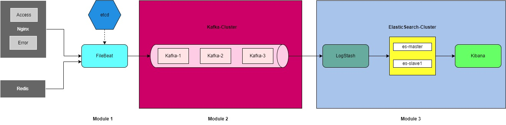

# 日志管理系统部署文档（单节点）

## 一、docker 安装(Windows宿主机)

虚拟化+windows docker desktop

[安装参考](https://zhuanlan.zhihu.com/p/510922099)


## 二、部署Filebeat

FileBeat支持对Nginx和Redis日志源的文件收集和基本解析，用docker-compose启动FileBeat

```bash
# Git Bash 环境下在 /filebeat中
./install.sh
```


## 三、部署Kafka

消息队列采用kafka，三个节点保证传输的可靠性

```bash
# Git Bash 环境下在 /kafka中
./install.sh
```


## 四、部署ELK

管理员模式下打开Power Shell，运行

```
wsl -d docker-desktop
sysctl -w vm.max_map_count=262144
```

进入`docker-elk/`

```bash
# Git Bash 环境下在 /docker-elk中
./pull.sh		# 拉取需要的镜像
./install.sh	# 创建实例
```

将默认启动两个es实例、logstash以及kibana，访问http://localhost:5601/即可进入kibana可视化界面


## 五、可扩展功能

- [ ] 添加日志源支持
    - [x] Nginx
    - [x] Redis
    - [ ] MySQL
    - [ ] sys
    - [ ] ...
- [ ] logstash时间戳预处理，地理位置转换
    - [x] Nginx
    - [x] Redis
    - [ ] ...
- [ ] 添加`.env`文件以动态修改host
- [ ] ES索引中多余字段的删除
- [ ] **系统效率测试**
    - [ ] 日志写入效率
    - [ ] **日志查询效率**
- [ ] ……


> P.S. 
>
> 1. 可通过修改`docker-elk\conf\logstash-filebeat.conf`的`input`字段的host和`filebeat\filebeat.yml`的`output`字段的host，调整三个module的对应主机
> 2. `\log`文件中有nginx和redis的事例log文件，其中`access.log`是40w级别的